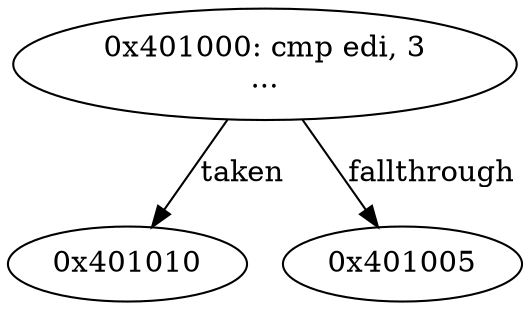

# Build Guide — Your Own Static Disassembler

## Goal and finished product

Build an authorized-analysis command-line tool that:

1. loads 64-bit little-endian x86 ELF files;
2. validates executable file-backed ranges;
3. decodes with Capstone detail metadata;
4. supports linear and recursive traversal;
5. recovers basic blocks and direct CFG edges;
6. labels symbols and unresolved indirect edges;
7. exports text and Graphviz DOT;
8. survives malformed files without out-of-bounds reads.

This deliberately separates loader, decoder, analysis policy, model, and output.

```text
ELF loader → Image model → Decoder → Traversal/CFG → Annotation → Output
```

## Stage 0 — project and tests

Suggested layout:

```text
minidis/
├── CMakeLists.txt
├── include/minidis/{image,decoder,cfg}.hpp
├── src/{main,image,decoder,cfg,dot}.cpp
└── tests/fixtures/
```

Dependencies: a supported C++ compiler, CMake, Capstone, and either libbfd as in the book or a carefully written ELF parser/library. Pin exact dependency versions for reproducibility.

Initial commands:

```bash
cmake -S . -B build -DCMAKE_BUILD_TYPE=Debug
cmake --build build
ctest --test-dir build --output-on-failure
```

Enable warnings and sanitizers for the tool itself:

```text
-Wall -Wextra -Wpedantic -Wconversion
-fsanitize=address,undefined -fno-omit-frame-pointer
```

## Stage 1 — normalized image model

```cpp
struct Range {
    uint64_t va;
    std::vector<std::byte> bytes;
    uint32_t perms;               // read/write/execute flags
    std::string name;
};

struct Image {
    std::filesystem::path path;
    std::array<std::byte, 32> sha256;
    uint64_t entry;
    std::vector<Range> ranges;
    std::map<uint64_t, std::string> symbols;
};
```

Use half-open ranges `[va, va+size)`, but implement containment safely:

```cpp
bool contains(uint64_t base, uint64_t size, uint64_t x) {
    return x >= base && (x - base) < size;
}
```

For an instruction span, verify `length <= size - offset` after proving `offset <= size`.

### Acceptance tests

- valid PIE/non-PIE ELF loads;
- stripped file yields empty/limited symbols, not failure;
- truncated tables reject cleanly;
- an address at end boundary is outside;
- zero-fill memory is not passed as file bytes.

## Stage 2 — ELF loading

Using Chapter 2/4 concepts:

1. validate magic/class/endianness/machine;
2. parse program headers with overflow-safe table bounds;
3. select `PT_LOAD` entries with execute flag and nonzero `p_filesz`;
4. copy only validated file-backed bytes;
5. record static VAs and permissions;
6. load trusted symbol entries when tables validate;
7. seed entry plus known executable symbols/init arrays.

Prefer program headers for runtime-relevant code ranges. Section metadata can add names/symbols but must not override contradictory load bounds.

## Stage 3 — Capstone decoder wrapper

Return structured instructions:

```cpp
enum class Flow { Next, CallDirect, CallIndirect, JumpDirect,
                  JumpIndirect, Conditional, Return, Stop };

struct Instruction {
    uint64_t address;
    uint16_t size;
    std::array<uint8_t, 15> bytes;
    unsigned byte_count;
    unsigned id;
    std::string mnemonic;
    std::string operands;
    Flow flow;
    std::optional<uint64_t> direct_target;
};
```

Classify flow using Capstone instruction groups and typed operands—not string comparisons. Copy data out of Capstone-owned structures. Verify decoded size is 1–15 and inside the range.

Test calls, conditional/unconditional jumps, indirect memory/register transfers, returns, invalid bytes, and instructions at range end.

## Stage 4 — linear mode

Algorithm:

```text
for each executable range:
  offset = 0
  while offset < byte_count:
    decode one at VA+offset
    if success: emit; offset += length
    else: emit `.byte`; offset += 1 (explicit recovery policy)
```

Expose `--stop-on-invalid` and `--data-on-invalid` so the user controls error policy. Mark output confidence `linear-candidate`, not “confirmed code.”

## Stage 5 — recursive CFG mode

Data structures:

```cpp
struct Block {
    uint64_t start;
    std::vector<Instruction> insns;
    std::set<uint64_t> successors;
    bool has_unresolved_successor;
};
```

Algorithm:

```text
worklist ← all validated seeds
while worklist not empty:
  start ← pop
  if a block already begins here: continue
  if target outside executable file-backed range: record external; continue
  decode sequentially
  stop when:
    instruction terminates block, or
    next address is known block leader, or
    decode/range fails
  add direct successors to worklist
  retain unresolved indirect successor marker
  if new leader lands inside old block: split old block and repair edges
```

Conditional branches add target and fall-through. Direct calls can add callee to a function-seed worklist while the intraprocedural block continues at fall-through. Unconditional jump has target only. Return has none.

## Stage 6 — jump-table recovery (bounded)

Recognize representative compiler patterns only after CFG/basic support works. A safe heuristic requires:

- dominating bounds check on index;
- table base in mapped read-only/file-backed data;
- fixed entry width/encoding;
- every computed target inside executable mapping;
- maximum case count derived from validated bound.

Label recovered targets as heuristic unless relocation/compiler metadata corroborates them. Reject enormous or overflowing counts.

## Stage 7 — function model

Seed functions from entry, symbols, init/fini arrays, direct call targets, and validated pointer tables. Do not use prologue matching as sole evidence. Track tail calls and shared blocks without forcing each block into exactly one source function.

## Stage 8 — DOT output



Escape labels safely. Provide JSON with addresses as strings/hex plus numeric values if consumers need exact 64-bit representation.

## Stage 9 — validation oracle

For each fixture:

1. compare entry/ranges with `readelf -hl`;
2. compare friendly instruction listings with `objdump`;
3. run fixture under a trace and ensure observed block starts exist in CFG;
4. test stripped/optimized/PIE variants;
5. mutate/truncate ELF bytes and fuzz the loader/decoder interface;
6. assert deterministic output.

Disagreement is an investigation, not automatic proof that the other tool is right.

## Stage 10 — extensions

- architecture abstraction;
- relocations and import annotations;
- dominators/loops;
- reaching definitions/liveness;
- bounded backward gadget scanner;
- trace import for observed indirect targets;
- IR lifting;
- database/project persistence.

## Debugging checklist

| Symptom | Likely cause |
|---|---|
| nonsense after one address | wrong boundary or inline data |
| branch target outside image | sign/PC-relative error or external/corrupt target |
| PIE mismatch | confusing static offset/runtime base |
| missing switch cases | unresolved jump table |
| duplicated blocks | no leader splitting/canonicalization |
| crash on malformed ELF | unchecked count/offset/string/ownership |

## Completion gate

- [ ] 10+ friendly and hostile fixtures pass under ASan/UBSan.
- [ ] Linear and recursive outputs explicitly differ by policy.
- [ ] Direct CFG edges and unresolved edges are represented.
- [ ] Stripped/PIE binaries work.
- [ ] DOT renders and JSON round-trips.
- [ ] Every parser range uses overflow-safe validation.
